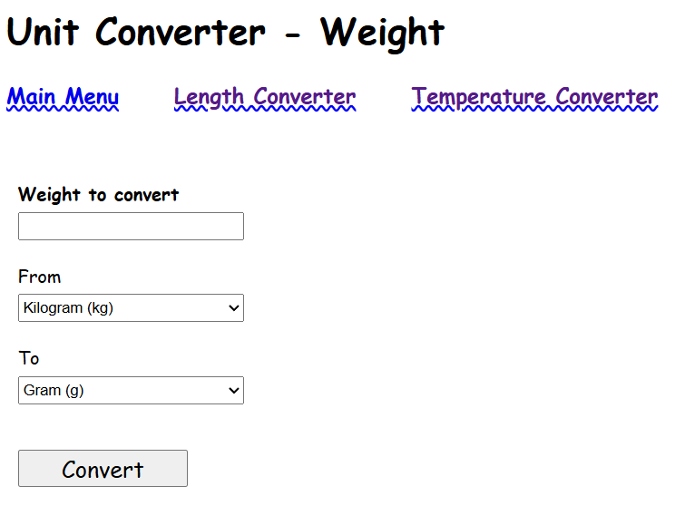
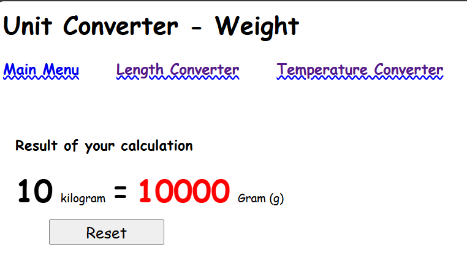

# simple-unit-converter
https://roadmap.sh/projects/unit-converter

**Disclaimer**: No AI was used in this development (except rates between units as JS objects)

## Intro
This is a simple Unit Converter, it works offline. My first solo web dev project. 

Temperature, Length and Weight conversion using only HTML/CSS + JS.

